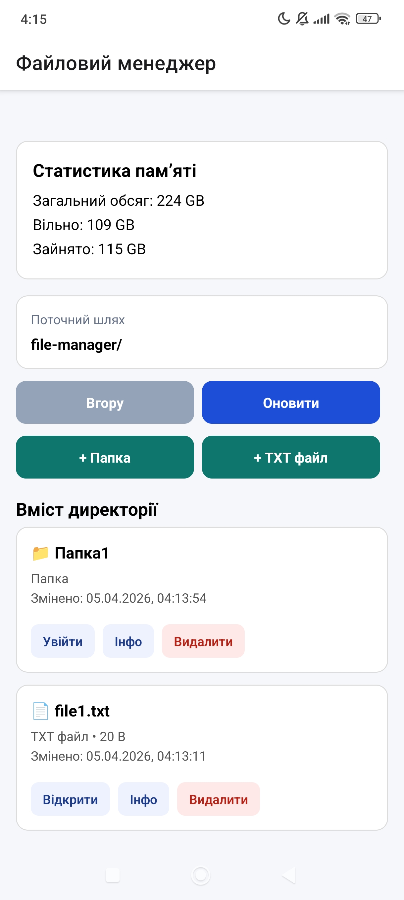
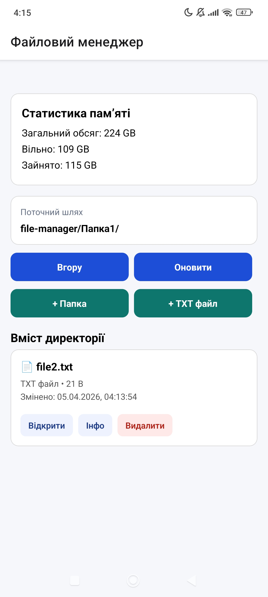
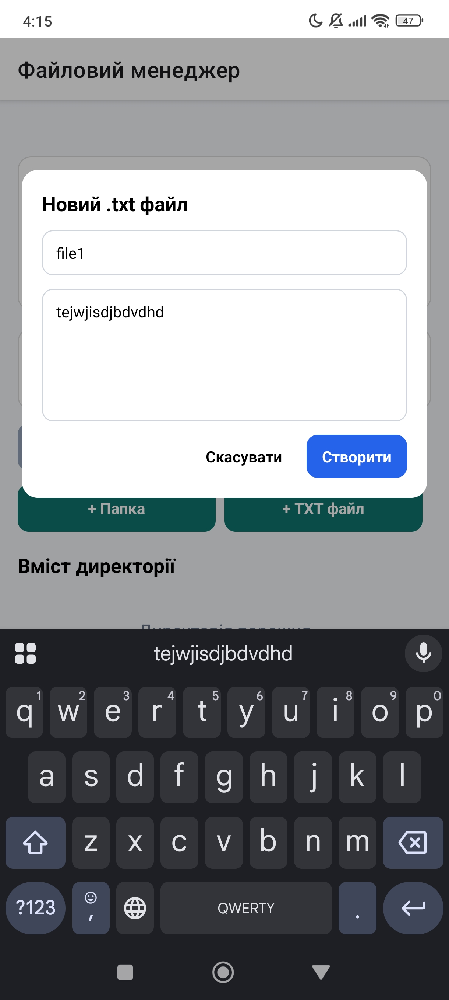
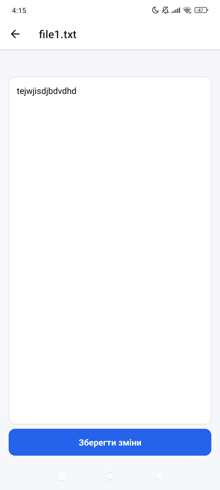
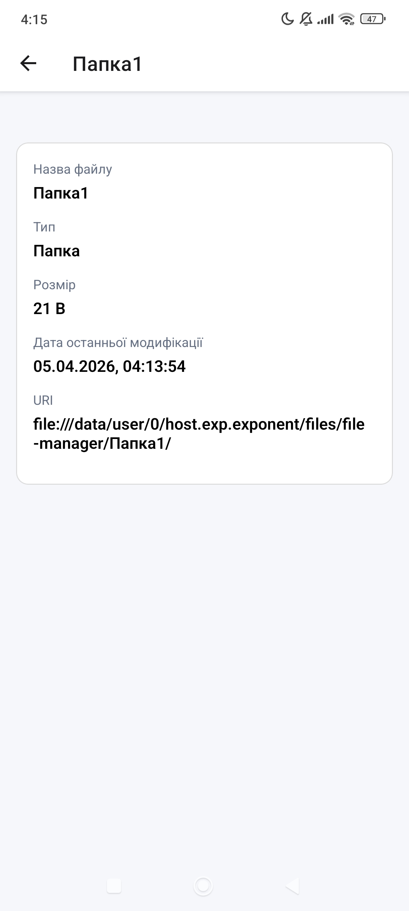

# lab4

## Опис проєкту
  Проєкт є мобільним застосунком у форматі файлового менеджера, розробленим за допомогою **React Native** та **Expo**. Основна ідея застосунку — надати користувачу можливість працювати з локальною файловою системою: переглядати вміст папок, створювати нові папки та текстові файли, відкривати й редагувати `.txt` файли, видаляти об’єкти, переглядати детальну інформацію про них, а також аналізувати статистику використання пам’яті пристрою.

## Інструкція із запуску
1. Клонувати репозиторій:
`git clone git@git.ztu.edu.ua:ipz222_roi/mobilelabsrn2026.git`

2. Перейти в папку лабораторної роботи:
`cd /lab4`

3. Встановити залежності:
`npm install`

4. Запустити проєкт:
`npx expo start -c`

## Опис реалізованого функціоналу

У застосунку реалізовано базовий файловий менеджер для роботи з локальною файловою системою мобільного застосунку. На головному екрані відображається поточний шлях до відкритої директорії, список файлів і папок, а також статистика використання пам’яті пристрою, зокрема загальний обсяг пам’яті, вільний простір і зайнятий обсяг. Користувач може переходити у вкладені папки, повертатися до попередньої директорії за допомогою кнопки переходу вгору та оновлювати вміст поточної папки.

У застосунку передбачено створення нових папок і текстових файлів формату `.txt`. Під час створення файлу користувач може ввести його назву та початковий вміст. Для текстових файлів реалізовано відкриття, перегляд вмісту, редагування тексту та збереження внесених змін. Також додано можливість видалення файлів і папок із попереднім підтвердженням дії.

Окремо реалізовано перегляд детальної інформації про об’єкти файлової системи. Для вибраного файлу або папки відображаються назва, тип, розмір, дата останньої модифікації та повний шлях. Інтерфейс застосунку побудований таким чином, щоб забезпечити зручну навігацію між екранами, зрозуміле розділення файлів і папок та просту взаємодію з основними файловими операціями.

## Скріншоти роботи застосунку

### Головний екран

### Навігація по папках

### Створення папки або текстового файлу

### Редагування текстового файлу

### Детальна інформація про файл або папку

