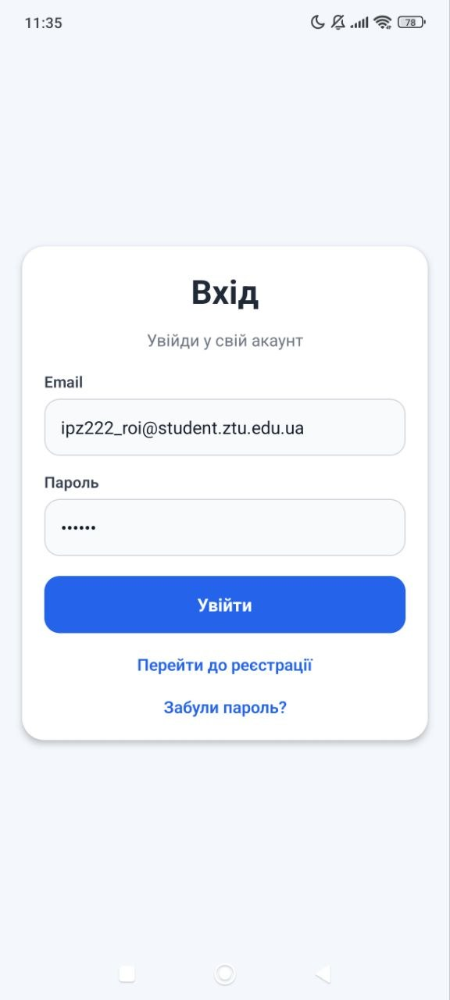
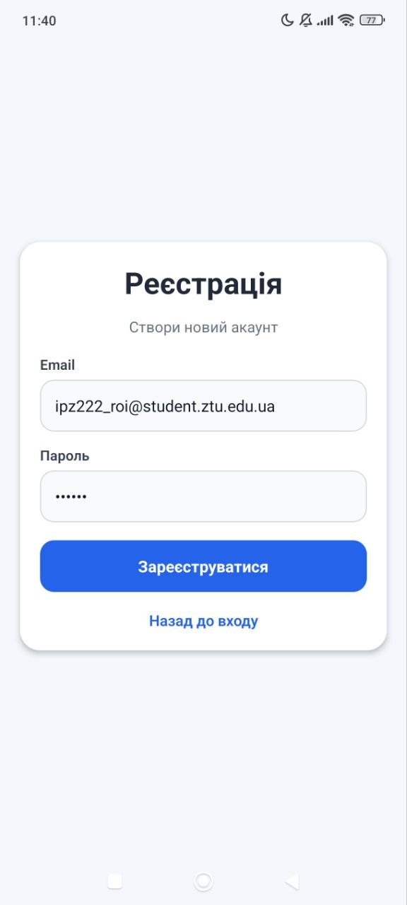
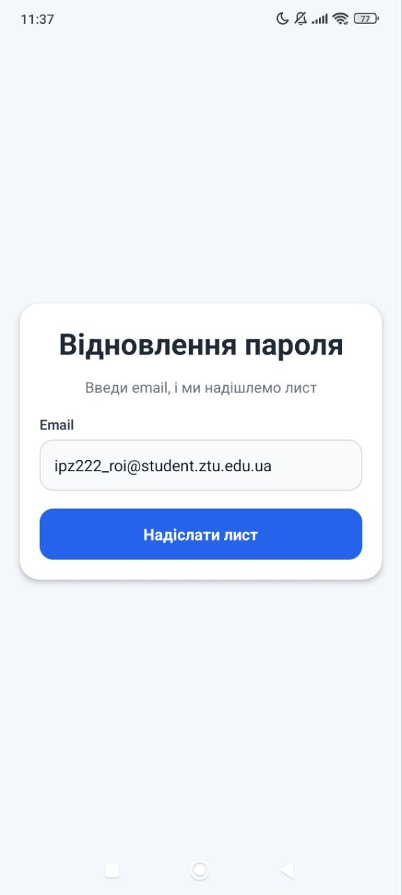
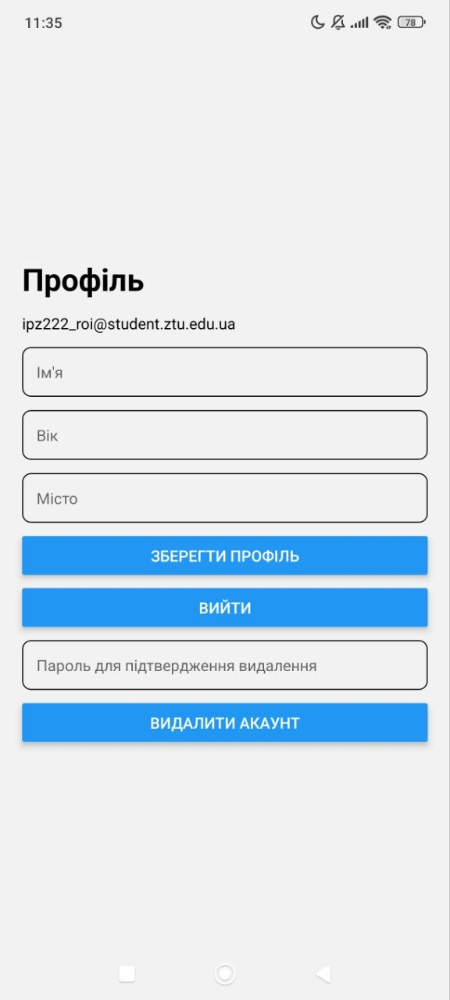
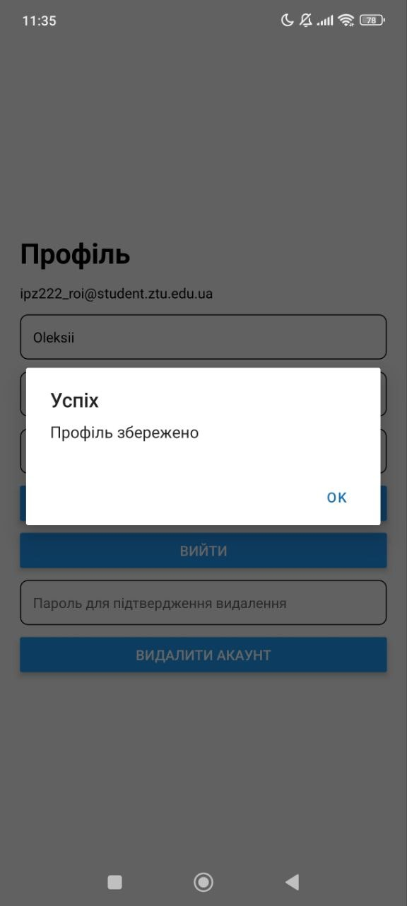
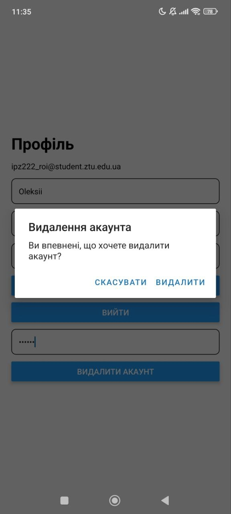
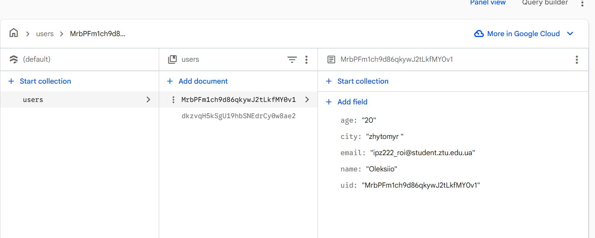

# lab6

## Опис проєкту
Проєкт є мобільним застосунком, створеним за допомогою **React Native**, **Expo Router**, **Firebase Authentication** та **Cloud Firestore**.

Застосунок реалізує базову систему авторизації користувача, роботу з персональними даними профілю, відновлення пароля через email, а також видалення облікового запису з повторною автентифікацією.

---

## Реалізований функціонал

### Авторизація користувача
- реєстрація нового користувача за допомогою email та пароля;
- вхід існуючого користувача;
- вихід із системи.

### Відновлення пароля
- надсилання листа для скидання пароля на email користувача через Firebase API.

### Робота з профілем
- перегляд профілю користувача;
- заповнення та оновлення персональних даних:
  - ім’я;
  - вік;
  - місто;
- збереження даних у **Cloud Firestore** в колекції `users`;
- документ користувача зберігається з ID, що відповідає `uid`.

### Захист доступу
- користувач працює тільки з власним документом у Firestore;
- у клієнтському коді використовується поточний `uid` авторизованого користувача;
- у Firestore налаштовано **Security Rules**, які забороняють доступ до чужих документів.

### Видалення облікового запису
- реалізовано кнопку видалення акаунта;
- додано підтвердження перед видаленням;
- перед видаленням виконується повторна автентифікація користувача.

### Навігація
- використано **Expo Router**;
- реалізовано групи маршрутів:
  - `(auth)` — сторінки авторизації;
  - `(app)` — захищена частина застосунку;
- виконано перенаправлення користувача залежно від статусу авторизації.

---

## Інструкція із запуску
1. Клонувати репозиторій:
`git clone https://github.com/hoowalex/MobileLabsRN2026`

2. Перейти в папку лабораторної роботи:
`cd /lab6`

3. Встановити залежності:
- Налаштувати Firebase:
- створити проєкт у Firebase;
- увімкнути Authentication → Email/Password;
- створити Cloud Firestore;
- вставити власну конфігурацію Firebase у файл `src/firebase/config.ts`;
- додати Firestore Security Rules.

4. Запустити проєкт:
`npx expo start `

## Скріншоти застосунку

### Екран входу

### Екран реєстрації

### Екран відновлення пароля

### Екран профілю

### Заповнений профіль

### Видалення акаунта

### Створені користувачі в Firestore

